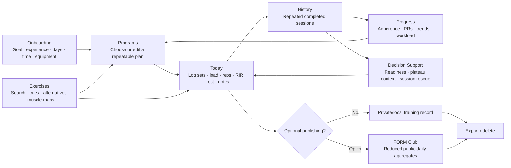
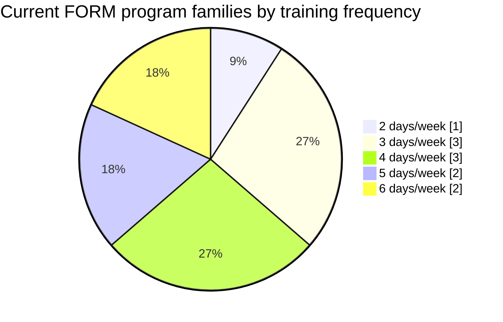
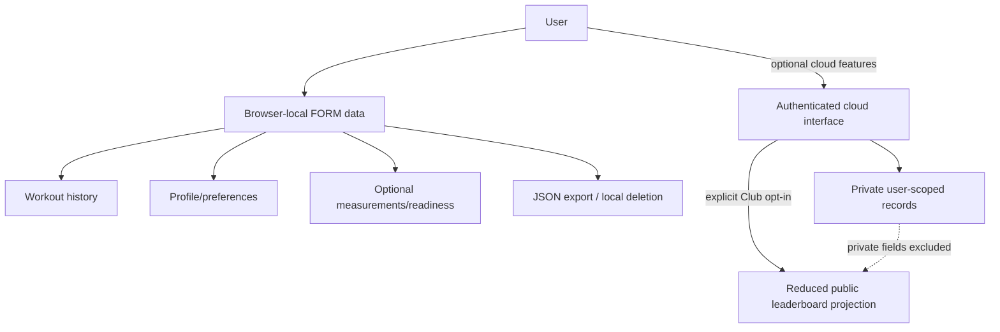

# FORM — Training System

### Private-first workout tracking, progression analytics, exercise intelligence and practical training decision support.

[**Open FORM →**](https://dharan1007.github.io/trakiler/)

**No subscription required · no advertising SDK · no wearable required · no location required · no promise of training outcomes**

---

## Try it first

**Live web app:** https://dharan1007.github.io/trakiler/

FORM is an independent research/side project built to explore a simpler way to log resistance training and turn repeated training history into useful, understandable feedback. It is intentionally closer to a transparent self-tracking instrument than to an opaque “AI coach.”

FORM does **not** diagnose injuries, prescribe medical treatment, guarantee muscle or strength gain, certify that a program is optimal, or replace a qualified physician, physiotherapist, dietitian or coach. Training decisions remain with the user. The product is provided as an educational/logging tool and experimental side project.

Questions, feedback or research/product discussion: **[dharan.poduvu@gmail.com](mailto:dharan.poduvu@gmail.com)**

---

## Contents

- [What FORM is](#what-form-is)
- [Product map](#product-map)
- [Feature coverage](#feature-coverage)
- [Today](#1-today--workout-execution)
- [Programs](#2-programs--editable-training-templates)
- [Progress](#3-progress--training-analytics)
- [Exercises](#4-exercises--exercise-intelligence)
- [Decision support](#5-decision-support--readiness-rescue-and-adjustments)
- [Club](#6-form-club--optional-public-consistency-layer)
- [Profile and privacy](#7-profile--privacy-and-data-controls)
- [Program library](#program-library)
- [Measurements and outputs](#measurements-and-outputs)
- [Accuracy and validation status](#accuracy-and-validation-status)
- [Privacy model](#privacy-model)
- [Public vs private project boundary](#public-vs-private-project-boundary)
- [Who FORM is for](#who-form-is-for)
- [Deliverables](#deliverables)
- [Research basis](#research-basis)
- [Limitations](#limitations)
- [Security](#security)
- [License status](#license-status)

---

# What FORM is

FORM combines seven practical jobs in one browser-based training system:

1. **Execute a workout** without turning logging into the workout itself.
2. **Choose or edit a repeatable program** based on goal, experience, available days and session time.
3. **Measure progression longitudinally** rather than judging a single workout.
4. **Inspect exercises** with muscle targeting, execution cues, alternatives and contextual rankings.
5. **Adapt a session** when time, readiness, discomfort or recent training history changes.
6. **Optionally participate in a consistency-oriented Club** without publishing private body measurements or detailed workout history.
7. **Retain control of data** through local-first storage, export, opt-in cloud recovery and deletion controls.

The central design principle is simple:

> **Repeated comparable training data is more useful than motivational noise.**

FORM therefore emphasizes consistency, repeatable exercises, effort context, personal history, private measurements and small adjustments instead of pretending that one generalized score can know a person's physiology.

---

# Product map

### Core loop

`Profile context → program → training session → repeated history → trend/decision support → next session`

FORM is designed so that the app becomes more useful as the user's own comparable history grows. It does not need a social profile, contacts, GPS, camera, microphone or wearable feed to provide its core experience.

---

# Feature coverage

| Surface | Primary job | Inputs | Main outputs | Default data scope |
|---|---|---|---|---|
| **Today** | Execute and record a session | weight, reps, RIR, completed sets, notes | completion, volume, working sets, load guidance, session record | Private/local |
| **Programs** | Select a sustainable training structure | goal, experience, days/week, session time | ranked templates, editable days, custom copy | Private/local |
| **Progress** | Understand repeated training performance | workout history, optional body logs | adherence, streaks, PRs, strength trends, workload, body trends | Private/local |
| **Exercises** | Understand and compare movements | search, category, equipment | FORM score, muscles, cues, heat map, alternatives, tutorial searches | Public reference data |
| **Decision Support** | Adjust training contextually | optional readiness, preferences, history, time | session mode, rescue plan, plateau flags, substitutions, alignment | Private/local; optional sync |
| **Club** | Lightweight consistency competition | opt-in display name, activity aggregates | daily score, rank, share card | Public only after opt-in |
| **Profile** | Configure defaults and control data | goal, experience, schedule, equipment, privacy | recommendations, cloud state, export/delete controls | Private except opted-in name/aggregates |

---

# 1. Today — workout execution

The **Today** screen is FORM's operational surface: the place where planned training becomes structured data.

### Session header

- Current program and training day.
- Training focus for the selected day.
- Session clock with start/pause control.
- Day strip for moving across the current program.

### Live session metrics

| Metric | Meaning | Important limitation |
|---|---|---|
| **Completion** | completed programmed sets / programmed sets | reflects logging completion, not workout quality |
| **Volume** | sum of entered load × repetitions for completed sets | a workload descriptor, not a direct hypertrophy measure |
| **Working sets** | number of sets marked complete | only as accurate as the user's logging |
| **Estimated load** | history-based next-set/load guidance | heuristic guidance, not a guaranteed optimal load |
| **Effort / RIR** | reps-in-reserve context for each set | subjective and exercise/lifter dependent |

### Per-set logging

Every programmed exercise can track:

- set completion,
- load in kilograms,
- repetitions,
- RIR,
- prescribed rest,
- exercise-specific next-load context.

Completing a set can automatically start its rest timer. The timer can be paused/resumed and adjusted in 15-second increments.

### Session notes

The user can capture context that numbers alone miss, such as:

- technique,
- discomfort,
- sleep/energy observations,
- substitutions,
- personal records,
- next-session targets.

### Exercise detail drawer

The inline exercise drawer exposes, where available:

- target and secondary muscles,
- front/back muscle heat maps,
- exercise benefits,
- execution cues,
- suggested rep/RIR/rest context,
- load guidance description,
- alternatives,
- contextual FORM score,
- three external YouTube search routes for technique demonstrations.

FORM links to searches rather than copying third-party video assets.

### Completing a workout

A completed session records the useful training payload: program/day context, timestamp, elapsed time, completed and planned sets, aggregate volume, notes, and completed set-level exercise/load/rep/RIR data.

### Sharing

A compact workout summary can be shared through the browser's native share surface when supported, with clipboard fallback.

---

# 2. Programs — editable training templates

FORM is not built around one “perfect program.” It provides **starting structures** that remain editable.

Program matching considers four explicit pieces of context:

- primary goal,
- training experience,
- available training days per week,
- expected session duration.

The user can then override the recommendation.

### Editing a day

A program day can be changed without rebuilding the whole system. Editable fields include:

- day name,
- focus,
- exercise selection,
- number of sets,
- rep target,
- RIR target,
- rest time,
- exercise order.

The exercise picker includes search/type-ahead assistance for exercise name, muscle and equipment.

### Custom programs

FORM can create an editable copy of the currently selected program, allowing experimentation without modifying the source template catalog.

---

# Program library

The current runtime contains **11 program families** spanning 2–6 training days per week.

| Days/week | Program family | Intended use |
|---:|---|---|
| 2 | Full Body 2-Day Minimum Effective | busy / low-frequency general, muscle or recomp starting point |
| 3 | Starter / Full Body | beginner general training and muscle-building base |
| 3 | Full Body | repeatable full-body structure |
| 3 | Recomposition | recoverable full-body schedule while bodyweight goals are managed separately |
| 4 | Upper / Lower | balanced split with repeated weekly exposures |
| 4 | Hypertrophy Upper / Lower | muscle-oriented four-day structure |
| 4 | General Strength | heavier primary work plus accessory volume |
| 5 | Aesthetic / Hypertrophy | higher-volume specialization distributed across five sessions |
| 5 | Hypertrophy 5-Day Balanced | balanced higher-frequency muscle-building structure |
| 6 | Aesthetic 6-Day Specialization | high-frequency aesthetic-priority structure |
| 6 | Push / Pull / Legs | classic six-day repeated split |

### Program-frequency distribution

The chart describes the **current catalog**, not an assertion that one frequency is superior.

---

# 3. Progress — training analytics

FORM's Progress surface is deliberately longitudinal. The goal is to answer **“What has been happening across repeated sessions?”** rather than “Was today's workout good?”

### Progress summary

- sessions completed versus weekly target,
- current on-target weekly streak,
- best weekly streak,
- recent aggregate training volume,
- number of exercises with established estimated-strength records,
- latest bodyweight and change from the previous entry.

### Weekly consistency

FORM treats rest days as part of training. The primary consistency streak is based on meeting a substantial portion of the chosen **weekly schedule**, rather than rewarding lifting every day.

### Exercise-specific strength trends

For repeated exercises, FORM derives an estimated-strength series from the user's own completed sets and displays recent trend cards/sparklines.

This is useful for identifying directional changes while keeping an important distinction:

> an **estimated 1RM is not a directly tested 1RM**.

### Personal records

The PR surface tracks the best estimated-strength result per exercise and shows the best contributing set and date. New-PR notices compare the latest session against earlier logged history.

### Muscle workload

The workload visualization uses a transparent weighted-set proxy that gives more credit to primary muscle involvement than secondary involvement. It is meant for programming review—not as EMG, muscle protein synthesis, tissue growth or “recovery percentage.”

### Body tracking

Optional bodyweight entries support:

- date,
- bodyweight,
- optional body-fat entry,
- contextual note.

Optional circumference tracking supports:

- waist,
- chest,
- shoulders,
- hips,
- left/right arm,
- left/right thigh,
- left/right calf.

These fields are private by default and are not intended to appear in the public Club projection.

---

# 4. Exercises — exercise intelligence

The Exercises screen is a searchable reference layer for movement selection.

### Search and discovery

Users can search by:

- exercise name,
- muscle,
- equipment,
- category/movement context.

Results can be sorted by contextual FORM score, name or category. Type-ahead results are keyboard accessible and return the closest high-value matches rather than requiring exact naming.

### Exercise records

Each exercise may include:

| Field | Purpose |
|---|---|
| Name/category/equipment | identification and practical filtering |
| Primary/secondary muscles | programming context |
| FORM score | relative programming aid |
| Benefits | why the movement may be useful |
| “Why” explanation | trade-off context |
| Execution cues | concise setup/technique reminders |
| Rep/RIR/rest context | starting prescription context |
| Load note | progression guidance |
| Alternatives | substitution candidates |
| Heat map | visual target-muscle approximation |

### What the FORM score means

The FORM score is a **relative programming aid**, informed by factors such as stability, target-muscle tension, usable range, progression practicality, fatigue/setup cost and evidence confidence.

It is **not**:

- an objective universal ranking of exercises,
- a medical safety score,
- an injury-risk probability,
- a measured hypertrophy percentage,
- a guarantee that a higher-scored exercise is better for every body, machine or goal.

---

# 5. Decision support — readiness, rescue and adjustments

FORM includes an additional decision-support layer that loads on top of the core logger. It is rules/heuristics driven and is intentionally transparent about uncertainty.

### Optional readiness check-in

A user can provide contextual self-report signals such as:

- sleep quality,
- energy,
- stress,
- soreness,
- motivation,
- joint-discomfort signal,
- time available.

The resulting session mode is a **decision aid**, not a medical recovery diagnosis.

Possible modes include concepts such as:

- normal/full session,
- focus/trim lower-priority work,
- minimum-useful session,
- modify around discomfort,
- reset/easy session/rest consideration.

### Confidence grows with history

FORM explicitly treats low-history decisions as lower confidence. Repeated sessions provide more context than an isolated workout.

### Session Rescue

When available time collapses, FORM can compress the current session toward higher-priority work rather than simply deleting exercises randomly. The original session can be retained for restoration.

### Exercise substitutions

Substitution ranking can consider:

- target-muscle overlap,
- exercise category,
- known alternatives,
- the user's prior exercise history,
- time/setup cost,
- preferred/avoided exercises,
- broad user constraints.

It remains a starting point; it cannot examine pain, technique or machine geometry.

### Plateau context

FORM can flag patterns such as:

- insufficient consistency to interpret a plateau,
- several repeated lifts staying approximately flat,
- multiple lifts trending down,
- persistently poor self-reported readiness,
- effort consistently much easier or harder than the programmed range.

These are **signals to investigate**, not causal diagnoses.

### Goal alignment and workload context

Muscle-priority settings allow users to distinguish between muscles they want to emphasize, grow, maintain or deprioritize. Logged weighted-set history is then compared with broad planning bands. These are guardrails, not claims about an individual's minimum effective volume or maximum recoverable volume.

### Return-from-break context

Long gaps in logged training can trigger conservative restart context. This is not rehabilitation advice and should not be used to manage an injury or medical return-to-play decision.

---

# 6. FORM Club — optional public consistency layer

FORM Club is deliberately narrower than the private training record.

### Publishing is opt-in

A user must enable a **Public Club profile** before global publishing is intended to occur.

### Public leaderboard fields

The reduced public projection can contain daily aggregate fields such as:

- display name,
- date,
- daily activity score,
- completed-set count,
- manually entered steps,
- manually entered active minutes,
- streak,
- aggregate workout volume.

### Fields that are not intended to be public Club data

- exact bodyweight,
- circumference measurements,
- email,
- workout notes,
- individual set history,
- readiness answers,
- exercise preferences/constraints.

### Demo rows

When the leaderboard has too little real data, FORM can show clearly labeled demo athletes as an empty-state. Demo rows are not presented as genuine ranked users.

### Local preview

If no cloud backend is configured, Club reports that state and remains a local preview rather than pretending a global ranking exists.

### Score interpretation

The Club score is a **gamification index** combining several daily consistency/activity signals. It is not a fitness test, health score, VO₂max estimate, calorie estimate or clinical measure.

---

# 7. Profile — privacy and data controls

The Profile surface controls the context FORM is allowed to use.

### Training profile

- optional display name,
- goal: general fitness / muscle gain / strength / recomposition,
- beginner / intermediate / advanced experience,
- 2–6 training days per week,
- expected session duration,
- equipment context,
- public Club opt-in.

### Program recommendations

Profile context is used to rank the program catalog. These are deterministic recommendation rules, not a machine-learning model and not a promise that the top-ranked template is physiologically optimal.

### Cloud and recovery

Where a secured backend deployment is configured, FORM can support:

- anonymous cloud identity,
- optional email magic-link recovery,
- functional record synchronization,
- account/data pull for export,
- cloud account deletion.

Email is optional and exists for recoverable access rather than advertising.

### User controls

- export available FORM data as JSON,
- delete local browser data,
- delete cloud account when configured,
- opt out of public Club publishing,
- keep core use local-only.

---

# Measurements and outputs

| Output | Type | Derived from | Intended interpretation |
|---|---|---|---|
| Completed sets | deterministic count | user check-offs | logged work completed |
| Session volume | deterministic arithmetic | load × reps | workload descriptor |
| Weekly adherence | deterministic ratio | sessions vs chosen weekly target | schedule consistency |
| Weekly streak | deterministic rule | repeated weekly adherence | consistency run |
| Estimated strength / e1RM | model-based estimate | submaximal load and reps | comparable strength proxy |
| Exercise PR | derived estimate | best historical exercise estimate | historical progression marker |
| Strength trend | time series | repeated exercise estimates | direction of change |
| Weighted muscle sets | programming proxy | exercise-muscle mapping + completed sets | recent workload distribution |
| Bodyweight trend | observed user input | repeated scale entries | directional bodyweight change |
| Circumference change | observed user input | repeated tape measurements | directional measurement change |
| Program match | deterministic ranking | goal, experience, days, duration | template starting point |
| Readiness/session mode | heuristic decision support | self-report + optional history | context for today's session |
| Plateau flag | heuristic pattern detection | repeated comparable sessions | signal to investigate |
| Session Rescue | heuristic prioritization | current plan, time, priorities | compressed session option |
| Exercise substitution | heuristic ranking | muscle overlap, context, preferences | replacement candidate list |
| Club score | gamification index | public daily aggregates | leaderboard comparison only |

---

# Accuracy and validation status

This section is intentionally strict. **FORM does not publish a blanket “accuracy percentage,” because most of its useful outputs are not classification models with a single meaningful accuracy metric.**

As of **8 August 2026**, no FORM-specific prospective clinical validation, randomized controlled trial, or published calibration benchmark is claimed by this repository. Where an output is heuristic, it is labelled as heuristic.

| Component | What can be said accurately | What must not be claimed |
|---|---|---|
| Logging arithmetic | deterministic when inputs are valid | that user-entered data itself is error-free |
| Volume totals | exact arithmetic over entered load/reps | that volume equals muscle growth or recovery |
| Weekly adherence/streaks | deterministic under FORM's definition | that adherence proves program quality |
| e1RM/estimated strength | established class of submaximal-strength estimation; useful for within-user tracking | universal 1RM accuracy, exact tested strength, equal error across exercises/rep ranges |
| RIR | practically useful self-regulation construct with published reliability evidence in studied settings | perfect perception accuracy across lifters, exercises and loads |
| Weighted sets | transparent programming proxy; fractional-set approaches also exist in research synthesis | direct measurement of hypertrophy, activation or recovery |
| FORM exercise score | structured relative ranking aid | calibrated physiological outcome probability |
| Readiness score | structured self-report heuristic | medical recovery %, injury risk or diagnosis |
| Plateau detection | repeat-history pattern flag | proven cause, sensitivity/specificity or prognosis |
| Program matching | deterministic fit ranking | “best program” guarantee |
| Club score | deterministic gamification | health, fitness or performance validity |

## Why there is no fake “95% accurate” badge

A useful validation question depends on the output:

- For **e1RM**, evaluate bias/error against directly tested exercise-specific 1RM across rep ranges and populations.
- For **program recommendations**, evaluate adherence, user outcomes, override rate and longitudinal progression—not classification accuracy.
- For **readiness**, evaluate reliability and predictive utility against subsequent performance while avoiding medical claims.
- For **plateau flags**, establish a ground-truth protocol before reporting sensitivity, specificity, precision or recall.
- For **substitutions**, evaluate user acceptance, target-muscle equivalence, discomfort outcomes and progression continuity.

Until those studies exist, FORM reports **calculation status and limitations**, not invented precision.

---

# Privacy model

### Local-first means

Core operation can remain in the browser. FORM does not require GPS, contacts, camera, microphone, wearable access, Apple Health, Health Connect, birth date or advertising identifiers for its current feature set.

### Optional cloud mode

A backend can be used for synchronization, recovery, public Club functionality and deletion/export workflows. Authentication may begin anonymously; email is optional for recoverable magic-link access.

### Public Club boundary

Public Club is meant to expose only reduced daily aggregates after opt-in—not the user's private body measurements, notes, detailed set history, readiness answers, constraints or email.

Read the current [Privacy Policy](./privacy.html) and [Terms of Use](./terms.html) before relying on the service for data that matters to you.

---

# Public vs private project boundary

FORM is moving toward a **public product/showcase + private implementation** model.

### Intended to remain public

- this README and product documentation,
- the live demo entry surface,
- privacy and terms pages,
- public-facing UI/build artifacts required to load the site,
- non-sensitive static assets,
- high-level feature descriptions,
- security contact/reporting instructions,
- high-level privacy/data-boundary documentation.

### Intended to be private

- backend implementation,
- database schema/migrations and privileged policies,
- internal API implementation,
- scoring coefficients and detailed recommendation rules,
- proprietary decision-engine/math implementation,
- internal architecture diagrams and deployment topology,
- research notebooks/internal experiments,
- private test fixtures/datasets,
- credentials, secrets and service-role keys,
- unpublished product/research IP.

### Important technical boundary

Anything executed in a user's browser can be inspected by that user. **Client-side JavaScript cannot be made secret merely by putting its repository in private mode or minifying it.** Proprietary algorithms that must remain confidential need to execute on a private server/API, with only the necessary inputs/outputs exposed to the browser.

The current public repository historically contained more implementation detail than this target model. See [SECURITY.md](./SECURITY.md) for the hardening/migration boundary.

---

# Who FORM is for

| User | Fit | Why |
|---|---|---|
| Adult beginner | Good with conservative judgment | templates, basic logging, technique context, no need for complex setup |
| Intermediate lifter | Strong | repeated exercise trends, RIR, editable programs, PR/workload context |
| Advanced recreational lifter | Useful as a logger/decision aid | high editability and history context, but no claim to replace advanced coaching |
| Hypertrophy-focused user | Strong | workload distribution, exercise library, repeated progression and priorities |
| Strength-focused user | Strong | heavier templates, exercise-specific estimated-strength trends and PRs |
| Recomposition/general fitness | Good | repeatable schedules plus private body tracking |
| Busy/time-constrained user | Strong | low-frequency programs and Session Rescue concepts |
| Privacy-conscious user | Strong | local-first use and explicit opt-in public layer |
| User seeking injury diagnosis | **Not appropriate** | FORM cannot examine or diagnose the user |
| User needing medical/rehabilitation prescription | **Not appropriate** | requires qualified professional care |
| Child/minor | **Not intended** | current Terms state adult use |

---

# Deliverables

The current FORM project delivers the following product surfaces and controls:

### Training execution

- structured workout logging,
- set completion,
- load/reps/RIR,
- rest timer,
- session clock,
- notes,
- workout completion/history,
- share summary.

### Programming

- 2–6 day program catalog,
- goal/experience/time/frequency matching,
- editable days,
- custom program copies,
- searchable exercise selection.

### Analytics

- weekly consistency,
- weekly streaks,
- estimated-strength PRs,
- exercise progression trends,
- recent workload distribution,
- bodyweight trends,
- circumference changes,
- contextual suggestions.

### Exercise intelligence

- relative exercise ranking,
- benefits and trade-offs,
- execution cues,
- muscle heat maps,
- alternatives,
- external tutorial searches.

### Decision support

- optional readiness inputs,
- session-mode context,
- confidence based on history depth,
- time-constrained session rescue,
- substitutions,
- plateau context,
- muscle-priority alignment,
- return-from-break conservatism.

### Privacy and account controls

- local-first mode,
- optional anonymous cloud identity,
- optional magic-link recovery,
- opt-in Club publishing,
- data export,
- local deletion,
- cloud deletion when configured,
- Privacy Policy and Terms.

---

# Research basis

FORM is a product experiment, not a scientific paper. Its design borrows concepts from resistance-training practice and literature, but **the cited research validates concepts in studied populations—not FORM as a whole**.

Selected background reading:

1. Lovegrove S, et al. **Repetitions in Reserve Is a Reliable Tool for Prescribing Resistance Training Load.** *Journal of Strength and Conditioning Research* (2022). PMID 36135029. https://pubmed.ncbi.nlm.nih.gov/36135029/
2. Halperin I, et al./related literature on reporting proximity to failure. **Methods for Controlling and Reporting Resistance Training Proximity to Failure: Current Issues and Future Directions.** PMID 35247203. https://pubmed.ncbi.nlm.nih.gov/35247203/
3. Robinson ZP, et al. **Exploring the Dose-Response Relationship Between Estimated Resistance Training Proximity to Failure, Strength Gain, and Muscle Hypertrophy.** *Sports Medicine* (2024). PMID 38970765. https://pubmed.ncbi.nlm.nih.gov/38970765/
4. Currier BS, et al. **Resistance training prescription for muscle strength and hypertrophy in healthy adults: a systematic review and Bayesian network meta-analysis.** *British Journal of Sports Medicine* (2023). PMID 37414459. https://pubmed.ncbi.nlm.nih.gov/37414459/
5. Pelland JC, et al. **The Resistance Training Dose Response: Meta-Regressions Exploring the Effects of Weekly Volume and Frequency on Muscle Hypertrophy and Strength Gains.** *Sports Medicine* (2026). PMID 41343037. https://pubmed.ncbi.nlm.nih.gov/41343037/
6. Kemmler W, et al. **Developing Accurate Repetition Prediction Equations for Trained Older Adults with Osteopenia.** (2024). PMID 39330710. https://pubmed.ncbi.nlm.nih.gov/39330710/

### Scientific interpretation used by FORM

- RIR can be useful, but subjective accuracy varies with context and load.
- Submaximal 1RM equations are estimates whose error varies by exercise, population and repetition range.
- Resistance-training outcomes depend on multiple interacting variables; one score cannot capture them all.
- Volume can be described with sets and fractional contributions, but those counts are not direct measurements of muscle growth.
- Higher-quality recommendations require longitudinal, comparable user data and must still tolerate individual variability.

---

# Limitations

FORM intentionally does **not** claim that it can:

- diagnose injury or disease,
- determine whether pain is safe,
- measure biological recovery,
- know true muscle activation from a static exercise map,
- infer sleep quality without user input,
- measure actual body composition from bodyweight/tape entries,
- guarantee hypertrophy, strength, fat loss or recomposition,
- guarantee that an estimated load will be completed,
- guarantee that a higher FORM score is better for an individual,
- guarantee that a plateau flag found the true cause,
- replace direct 1RM testing where such testing is appropriate and safe,
- replace qualified coaching, physiotherapy, dietetic or medical judgment.

Hardware, machine geometry, exercise technique, range of motion, motivation, fatigue, nutrition, sleep, injury history and individual response can all change the meaning of the same logged numbers.

---

# Security

Please read [SECURITY.md](./SECURITY.md).

Core principles:

- never ship service-role keys or server secrets to the browser,
- keep private user records owner-scoped,
- expose only a reduced opt-in public leaderboard projection,
- separate public deployment artifacts from private backend/algorithm source,
- treat client-side code as inspectable,
- rotate any credential immediately if it is ever committed publicly,
- remember that deleting a file from the current branch does not automatically erase it from Git history.

Security/privacy reports: **[dharan.poduvu@gmail.com](mailto:dharan.poduvu@gmail.com)**

Please do not include passwords, tokens, private medical information or other highly sensitive personal data in a report.

---

# Verification

The repository includes an automated verification workflow for required web/legal/privacy artifacts and selected security invariants. Runtime behavior should still be tested in a browser after meaningful changes.

Recommended public-release checks include:

- parse all browser JavaScript,
- load all screens on desktop/mobile widths,
- verify local-only mode,
- verify onboarding/legal acceptance,
- verify data export/delete controls,
- verify that Club cannot expose private body or set-level fields,
- verify no secret/server credential is present in deploy artifacts,
- verify external links use safe target handling,
- verify accessibility/keyboard behavior of interactive controls.

---

# License status

**Current direction:** public showcase/documentation with proprietary private internals.

Earlier revisions of this repository were explicitly published under **The Unlicense / public-domain intent**. Rights that were validly granted to recipients of those historical revisions are not represented here as retroactively revoked.

Current/future proprietary source, algorithms, backend code, schemas, research and internal architecture are intended to be withheld from the public repository unless an explicit license says otherwise. See the repository's current [`LICENSE`](./LICENSE) notice.

Third-party libraries, APIs, services, linked websites and content retain their own terms and licenses.

---

# Project status

FORM is an **independent research and side project**. It is provided to explore better training self-tracking and to help users organize their own data—not to influence professional medical decisions or promise outcomes.

The project may change, break, lose features, move infrastructure or be discontinued. Export any history you care about.

**Try FORM:** https://dharan1007.github.io/trakiler/

**Contact:** [dharan.poduvu@gmail.com](mailto:dharan.poduvu@gmail.com)

---

Discovery keywords: workout tracker · gym tracker · strength training · resistance training · progressive overload · hypertrophy · workout planner · training analytics · fitness app · exercise science · sports science · self tracking · personal analytics · privacy first · local first · JavaScript · Supabase · GitHub Pages · data visualization · fitness technology
